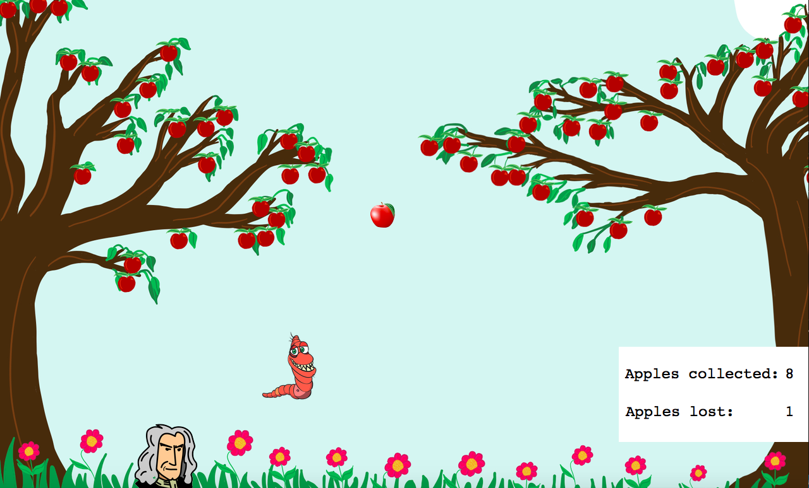

# Python Final Project

## Project title
Apple-ying Gravity 

## Project description
This is a game-based project that uses the Python Portable Graphics Library (PGL). 

## Tech/Framework used
Python

## Installation / How to Run?
All files should be placed in the same directory. Run main.py using the statement:
python3 main.py

## How to Play
Click to begin. Use your right and left arrows to move Isaac Newton so that the apples will fall on his head. 
Try not to lose any! If you lose 3, you lose! However, if you manage to collect 25, you win! Avoid the worms, they will
make you lose automatically. The game will get harder as you progress because the apples will fall faster from the sky. 

## Game Preview
